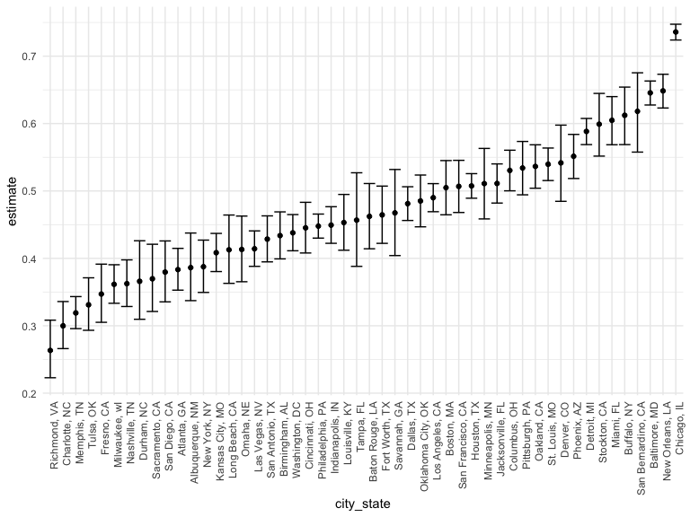

Homework 5
================
Youssra Yemmas
2023-11-12

## Problem 1

For the city of Baltimore, MD, use the prop.test function to estimate
the proportion of homicides that are unsolved; save the output of
prop.test as an R object, apply the broom::tidy to this object and pull
the estimated proportion and confidence intervals from the resulting
tidy dataframe.

Now run prop.test for each of the cities in your dataset, and extract
both the proportion of unsolved homicides and the confidence interval
for each. Do this within a “tidy” pipeline, making use of purrr::map,
purrr::map2, list columns and unnest as necessary to create a tidy
dataframe with estimated proportions and CIs for each city.

Create a plot that shows the estimates and CIs for each city – check out
geom_errorbar for a way to add error bars based on the upper and lower
limits. Organize cities according to the proportion of unsolved
homicides.

``` r
# first I need to read in the data from the csv file or from the github repo. It does not read correctly from the csv file so I used the github.
wp_homicide_df =
  read_csv("https://raw.githubusercontent.com/washingtonpost/data-homicides/master/homicide-data.csv")
```

    ## Rows: 52179 Columns: 12
    ## ── Column specification ────────────────────────────────────────────────────────
    ## Delimiter: ","
    ## chr (9): uid, victim_last, victim_first, victim_race, victim_age, victim_sex...
    ## dbl (3): reported_date, lat, lon
    ## 
    ## ℹ Use `spec()` to retrieve the full column specification for this data.
    ## ℹ Specify the column types or set `show_col_types = FALSE` to quiet this message.

``` r
head(wp_homicide_df)
```

    ## # A tibble: 6 × 12
    ##   uid   reported_date victim_last victim_first victim_race victim_age victim_sex
    ##   <chr>         <dbl> <chr>       <chr>        <chr>       <chr>      <chr>     
    ## 1 Alb-…      20100504 GARCIA      JUAN         Hispanic    78         Male      
    ## 2 Alb-…      20100216 MONTOYA     CAMERON      Hispanic    17         Male      
    ## 3 Alb-…      20100601 SATTERFIELD VIVIANA      White       15         Female    
    ## 4 Alb-…      20100101 MENDIOLA    CARLOS       Hispanic    32         Male      
    ## 5 Alb-…      20100102 MULA        VIVIAN       White       72         Female    
    ## 6 Alb-…      20100126 BOOK        GERALDINE    White       91         Female    
    ## # ℹ 5 more variables: city <chr>, state <chr>, lat <dbl>, lon <dbl>,
    ## #   disposition <chr>

``` r
nrow(wp_homicide_df)
```

    ## [1] 52179

``` r
ncol(wp_homicide_df)
```

    ## [1] 12

The raw data has 52179 observations of 12 variables.

# Tidying the data, creating a city_state variable and two data frames one that summarises total homicides and one that summarises unsolved homicides

``` r
wp_homicide_tidied = 
  wp_homicide_df %>% 
  mutate(
    city_state = str_c(city, state, sep = ", "),
    resolution = case_when(
      disposition == "Closed without arrest" ~ "unsolved",
      disposition == "Open/No arrest"        ~ "unsolved",
      disposition == "Closed by arrest"      ~ "solved"
    )
  ) %>% 
  filter(!city_state == "Tulsa, AL")

homicide_sum = 
  wp_homicide_tidied %>% 
  group_by(city_state) %>% 
  summarize(
    total_homicides = n())

homicide_sum %>% 
  knitr::kable()
```

| city_state         | total_homicides |
|:-------------------|----------------:|
| Albuquerque, NM    |             378 |
| Atlanta, GA        |             973 |
| Baltimore, MD      |            2827 |
| Baton Rouge, LA    |             424 |
| Birmingham, AL     |             800 |
| Boston, MA         |             614 |
| Buffalo, NY        |             521 |
| Charlotte, NC      |             687 |
| Chicago, IL        |            5535 |
| Cincinnati, OH     |             694 |
| Columbus, OH       |            1084 |
| Dallas, TX         |            1567 |
| Denver, CO         |             312 |
| Detroit, MI        |            2519 |
| Durham, NC         |             276 |
| Fort Worth, TX     |             549 |
| Fresno, CA         |             487 |
| Houston, TX        |            2942 |
| Indianapolis, IN   |            1322 |
| Jacksonville, FL   |            1168 |
| Kansas City, MO    |            1190 |
| Las Vegas, NV      |            1381 |
| Long Beach, CA     |             378 |
| Los Angeles, CA    |            2257 |
| Louisville, KY     |             576 |
| Memphis, TN        |            1514 |
| Miami, FL          |             744 |
| Milwaukee, wI      |            1115 |
| Minneapolis, MN    |             366 |
| Nashville, TN      |             767 |
| New Orleans, LA    |            1434 |
| New York, NY       |             627 |
| Oakland, CA        |             947 |
| Oklahoma City, OK  |             672 |
| Omaha, NE          |             409 |
| Philadelphia, PA   |            3037 |
| Phoenix, AZ        |             914 |
| Pittsburgh, PA     |             631 |
| Richmond, VA       |             429 |
| Sacramento, CA     |             376 |
| San Antonio, TX    |             833 |
| San Bernardino, CA |             275 |
| San Diego, CA      |             461 |
| San Francisco, CA  |             663 |
| Savannah, GA       |             246 |
| St. Louis, MO      |            1677 |
| Stockton, CA       |             444 |
| Tampa, FL          |             208 |
| Tulsa, OK          |             583 |
| Washington, DC     |            1345 |

``` r
unsolved_homicide_sum =
  wp_homicide_tidied %>% 
  filter(disposition %in% c("Closed without arrest", "Open/No arrest")) %>% 
  group_by(city_state) %>% 
  summarize(
    total_unsolved = n())

unsolved_homicide_sum %>% 
  knitr::kable()
```

| city_state         | total_unsolved |
|:-------------------|---------------:|
| Albuquerque, NM    |            146 |
| Atlanta, GA        |            373 |
| Baltimore, MD      |           1825 |
| Baton Rouge, LA    |            196 |
| Birmingham, AL     |            347 |
| Boston, MA         |            310 |
| Buffalo, NY        |            319 |
| Charlotte, NC      |            206 |
| Chicago, IL        |           4073 |
| Cincinnati, OH     |            309 |
| Columbus, OH       |            575 |
| Dallas, TX         |            754 |
| Denver, CO         |            169 |
| Detroit, MI        |           1482 |
| Durham, NC         |            101 |
| Fort Worth, TX     |            255 |
| Fresno, CA         |            169 |
| Houston, TX        |           1493 |
| Indianapolis, IN   |            594 |
| Jacksonville, FL   |            597 |
| Kansas City, MO    |            486 |
| Las Vegas, NV      |            572 |
| Long Beach, CA     |            156 |
| Los Angeles, CA    |           1106 |
| Louisville, KY     |            261 |
| Memphis, TN        |            483 |
| Miami, FL          |            450 |
| Milwaukee, wI      |            403 |
| Minneapolis, MN    |            187 |
| Nashville, TN      |            278 |
| New Orleans, LA    |            930 |
| New York, NY       |            243 |
| Oakland, CA        |            508 |
| Oklahoma City, OK  |            326 |
| Omaha, NE          |            169 |
| Philadelphia, PA   |           1360 |
| Phoenix, AZ        |            504 |
| Pittsburgh, PA     |            337 |
| Richmond, VA       |            113 |
| Sacramento, CA     |            139 |
| San Antonio, TX    |            357 |
| San Bernardino, CA |            170 |
| San Diego, CA      |            175 |
| San Francisco, CA  |            336 |
| Savannah, GA       |            115 |
| St. Louis, MO      |            905 |
| Stockton, CA       |            266 |
| Tampa, FL          |             95 |
| Tulsa, OK          |            193 |
| Washington, DC     |            589 |

``` r
#why is there only one homicide for Tusla, AL? Maybe I should remove it from the dataset because I can see from googling it that there is no such city as Tulsa in Alabama. Or should I try to include it in the Tulsa, OK dataset because from the lat and lon it seems to be in that city. I think I am just going to remove it.
```

## Problem 1 cont.

``` r
# using the 'r prop.test' function to estimate the proportion of homicides that are unsolved in the city_state of Baltimore, MD

homicide_prop_test = function(x) {
  
  n_hom =
    homicide_sum %>% 
    filter(city_state == x) %>% 
    pull(total_homicides)
  
  n_un =
    unsolved_homicide_sum %>% 
    filter(city_state == x) %>% 
    pull(total_unsolved)
  
  result = broom::tidy(prop.test(x = n_un, n_hom))
  
}

homicide_prop_test("Baltimore, MD") %>% 
  knitr::kable()
```

|  estimate | statistic | p.value | parameter |  conf.low | conf.high | method                                               | alternative |
|----------:|----------:|--------:|----------:|----------:|----------:|:-----------------------------------------------------|:------------|
| 0.6455607 |   239.011 |       0 |         1 | 0.6275625 | 0.6631599 | 1-sample proportions test with continuity correction | two.sided   |

``` r
# The estimated proportion for the city, state of Baltimore, MD is 0.646 with a 95% CI of (0.628, 0.663)
```

# Part 1 cont trying Prof Goldsmith code because I really dont understand this

``` r
city_homicide_df = 
  wp_homicide_tidied %>% 
  select(city_state, disposition, resolution) %>% 
  group_by(city_state) %>% 
  summarize(
    hom_total = n(),
    hom_unsolved = sum(resolution == "unsolved"))

bmore_test = 
  prop.test(
    x = filter(city_homicide_df, city_state == "Baltimore, MD") %>% pull(hom_unsolved),
    n = filter(city_homicide_df, city_state == "Baltimore, MD") %>% pull(hom_total)) 

broom::tidy(bmore_test) %>% 
  knitr::kable(digits = 3)
```

| estimate | statistic | p.value | parameter | conf.low | conf.high | method                                               | alternative |
|---------:|----------:|--------:|----------:|---------:|----------:|:-----------------------------------------------------|:------------|
|    0.646 |   239.011 |       0 |         1 |    0.628 |     0.663 | 1-sample proportions test with continuity correction | two.sided   |

``` r
test_results = 
  city_homicide_df %>% 
  mutate(
    prop_tests = map2(hom_unsolved, hom_total, \(x, y) prop.test(x = x, n = y)),
    tidy_tests = map(prop_tests, broom::tidy)) %>% 
  select(-prop_tests) %>% 
  unnest(tidy_tests) %>% 
  select(city_state, estimate, conf.low, conf.high) %>% 
  mutate(city_state = fct_reorder(city_state, estimate))

test_results %>% 
  mutate(city_state = fct_reorder(city_state, estimate)) %>% 
  ggplot(aes(x = city_state, y = estimate)) + 
  geom_point() + 
  geom_errorbar(aes(ymin = conf.low, ymax = conf.high)) + 
  theme(axis.text.x = element_text(angle = 90, hjust = 1))
```


